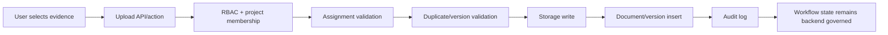
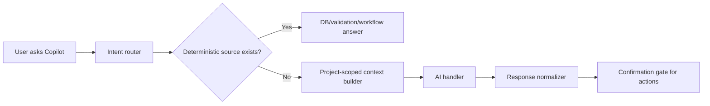
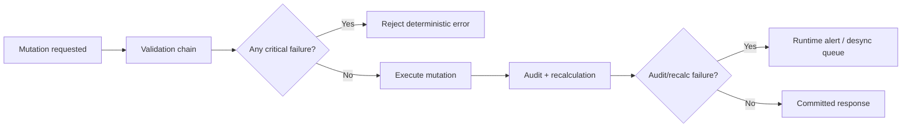

# Tracknov Runtime Authority Matrices

Date: 2026-05-06 IST

This artifact records the runtime authority boundaries used by the current implementation pass. It is intentionally strict: frontend and AI are interaction layers only; workflow, validation, audit, scoring, and certification authority remain backend/database governed.

## Action Authority Matrix

| Action | Allowed Authority | Forbidden Authority | Enforcement Point | Evidence |
|---|---|---|---|---|
| Workflow transition | Orchestrator + workflow engine | Frontend, AI, direct DB write | `POST /api/workflow/transition` | `app/api/workflow/transition/route.ts`, `lib/services/workflow-orchestrator-service.ts` |
| Document upload | API/service layer after role + assignment validation | Direct frontend DB write, AI direct mutation | document actions/services | `app/actions.ts`, `lib/services/document-service.ts` |
| L1 review | Review service through orchestrator | UI-only update, AI approval | review service | `lib/services/review-service.ts` |
| L3 validation/final decision | Review service through orchestrator | L0/L1/L2, AI | RBAC + workflow service | `lib/rbac.ts`, `lib/services/workflow-orchestrator-service.ts` |
| L5 override | Orchestrator with reason | L3/L1/L0/L2, silent override | orchestrator + DB logs | `lib/services/workflow-orchestrator-service.ts`, `supabase/migrations/0056_runtime_semantics_orchestration_hardening.sql` |
| Certification lock | DB/runtime governance | UI flag only | DB trigger + orchestrator lock check | `supabase/migrations/0056_runtime_semantics_orchestration_hardening.sql` |
| AI recommendation | Copilot governance | AI state mutation | response normalizer + confirmation gate | `lib/services/copilot-governance.ts`, `app/api/assistant/route.ts` |

## Mutation Authority Matrix

| Mutation | Required Sequence | Rollback Requirement | Current Status |
|---|---|---|---|
| Document state change | authenticate -> membership -> capability -> lock -> transition -> audit -> metrics | Must reject before mutation on failed validation | Partial: centralized for review service document transitions |
| Submittal state change | authenticate -> assignment -> validation -> transition -> audit -> derived recalculation | Must reject before mutation on failed validation | Partial: legacy submittal path still exists |
| Certification issuance | validate mandatory credits -> snapshot evidence/rules/scoring -> lock project | Snapshot + lock must be atomic | Partial: DB snapshot/lock function added; live migration pending |
| Override | L5 check -> mandatory reason -> before/after snapshot -> immutable log | Reject if reason missing or actor not L5 | Partial: orchestrator check exists; snapshot depth needs hardening |

## Workflow Authority Matrix

| Entity | Legal Source | Runtime Guard | Remaining Gap |
|---|---|---|---|
| Document | `workflow_transition_rules` + `transitionDocumentState` | DB trigger + orchestrator/service validation | All direct callers must be routed through endpoint |
| Submittal | `submittals` lifecycle + validation rules | Existing service logic | Needs full orchestrator support |
| Credit stage | Derived from child submittals | recalculation procedures | Needs live DB verification |
| Project credit | Derived from credit stage/submittals | recalculation procedures | Needs live DB verification |
| Project/certification | Derived from scoring + mandatory validation | certification snapshot function | Needs full snapshot UAT |

## AI Capability Matrix

| Capability | Allowed | Enforcement |
|---|---:|---|
| Summarize uploaded file | Yes | Copilot governance + project-scoped context |
| Suggest likely credit mappings | Yes | advisory response + confirmation gate |
| Explain validation failure | Yes | deterministic validation context first |
| Approve/reject/transition | No | AI has no direct mutation endpoint |
| Override validation or workflow | No | orchestrator L5-only path |
| Access unrelated project data | No | project-scoped context builder |

## Runtime Diagrams

### Workflow Transition Lifecycle

```mermaid
flowchart LR
  A["UI/API request"] --> B["/api/workflow/transition"]
  B --> C["Authenticate user"]
  C --> D["Validate project membership"]
  D --> E["Validate capability and lock state"]
  E --> F["Validate workflow legality"]
  F --> G["Run workflow transition service"]
  G --> H["Write audit/workflow history"]
  H --> I["Recalculate derived state"]
  I --> J["Return deterministic response"]
```



### Document Upload Lifecycle



### AI Query Lifecycle



### Rollback / Failure Lifecycle



## API Execution Contract: Workflow Transition

Endpoint: `POST /api/workflow/transition`

Required request:

```json
{
  "entity_type": "document",
  "entity_id": "...",
  "target_state": "SUBMITTED",
  "action": "submit",
  "reason": "",
  "metadata": {}
}
```

Required response:

```json
{
  "workflow_state": "SUBMITTED",
  "allowed_actions": [],
  "lock_state": {},
  "validation_status": "passed",
  "audit_reference": null,
  "derived_state_summary": {}
}
```

Known limitation after this pass: document transitions initiated by the review service are routed through the orchestrator; remaining legacy mutation paths must be audited and migrated before this can be marked universal.
