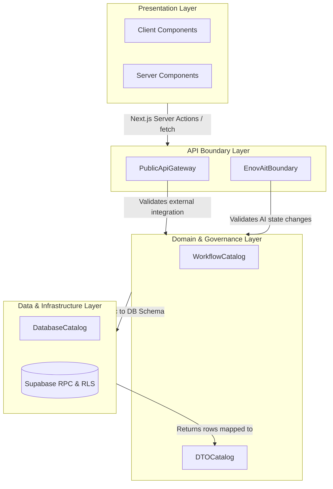

# Tracknov Architecture Dependency Graph
**Version**: V2 Execution Baseline
**Status**: LOCKED (Rule #67)

This manifesto defines the strict architectural boundaries and dependency flow across the Tracknov stack. Direct violations of this dependency graph (e.g., UI directly calling Database without DTO boundary) are prohibited.

## Core Dependency Flow

## Architectural Laws (Rule #67 Enforcement)

1. **Upward Dependency Ban**: The Data Layer cannot import or depend on Domain or API Layers. The Domain layer cannot depend on the UI.
2. **DTO Purity**: All objects crossing from the `API Boundary Layer` into the `Presentation Layer` MUST be typed as a `*Dto` (e.g., `ProjectDto`). Raw Supabase rows are strictly banned from crossing the API boundary.
3. **Workflow Routing**: Any mutation that changes the `state` of an entity (Project, Credit, Document) MUST be validated against the `WorkflowCatalog` state machines before being passed to the `DatabaseCatalog`.
4. **EnovAIT Isolation**: The EnovAIT Copilot operates outside the primary workflow state machine. It is strictly routed through the `EnovAitBoundary` interceptor, stripping it of any capability to directly transition state values (`APPROVED`, `REJECTED`, etc.) without a human L3/L5 authorization.

*This dependency graph is structurally enforced via TypeScript types and API gateway interceptors deployed in the V2 Execution Baseline.*
