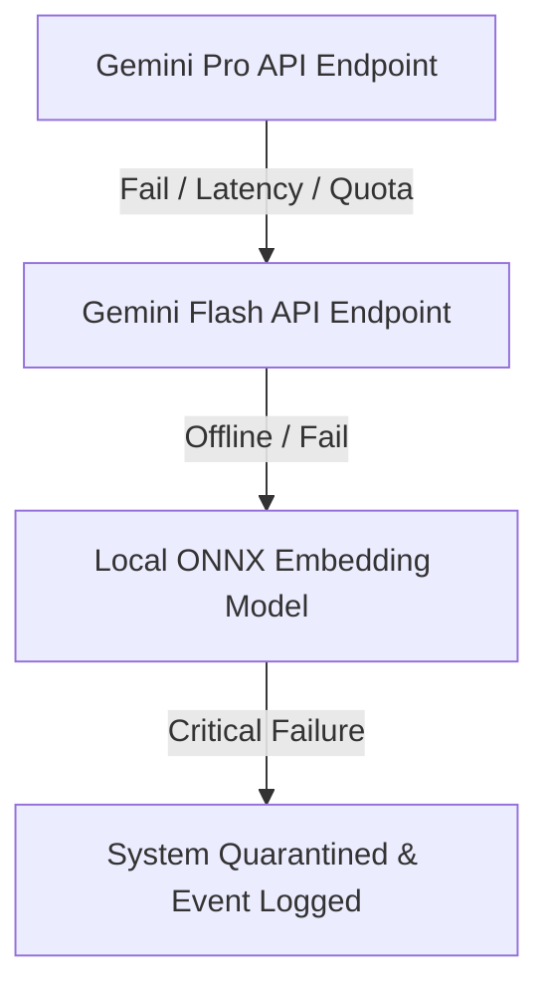

# Tracknov Authoritative Infrastructure Contracts

This document establishes the definitive, binding operational contract between the **Tracknov Sustainability Intelligence Engine** and its hosting environment. All production deployments must strictly adhere to these specifications to guarantee zero-drift replay capabilities and complete tenant isolation.

---

## 1. Authoritative Environment Variables

| Variable Name | Schema / Allowed Values | Scope / Purpose | Required |
| :--- | :--- | :--- | :--- |
| `NEXT_PUBLIC_SUPABASE_URL` | Valid HTTPS URL | Supabase public API endpoint | **Yes** |
| `NEXT_PUBLIC_SUPABASE_ANON_KEY` | Valid Supabase JWT string | Client anon auth key | **Yes** |
| `SUPABASE_SERVICE_ROLE_KEY` | Valid Supabase JWT string | Backend administrative override key | **Yes** |
| `GEMINI_API_KEY` | Hex/String format | AI processing and embedding provider | **Yes** |
| `FORCE_JAVASCRIPT_ACTIONS_TO_NODE24` | `true` \| `false` | CI environment action override flag | Optional |
| `TENANT_ISOLATION_STRICTNESS` | `STRICT` \| `LAX` | Row-Level Security isolation check strategy | **Yes** |
| `REPLAY_DETERMINISM_LAWS` | `HARD_ENFORCE` \| `ADVISORY` | Throw error if drift detected in transactional state | **Yes** |

---

## 2. Queue & Process Dependencies

Tracknov uses transactional database state queues (`replay_queue`) to enforce state changes sequentially.
* **Lock Management**: Uses database session advisory locks (`pg_advisory_xact_lock`) under transaction level to isolate replay mutations.
* **Concurrency Rules**: Max concurrent write transactions must be constrained by the deployment profile limits (e.g., maximum of 16 concurrent executions in standard Enterprise VPC).
* **Retry Strategy**: Failed state mutations in the replay queue trigger transactional rollbacks with a maximum of 3 automated retries before shifting the transaction into the governance quarantine ledger.

---

## 3. AI Provider Fallback Chain

When the primary semantic service encounters API errors, latency threshold breaches (e.g., >4500ms), or cost quota restrictions, the engine automatically falls back:

---

## 4. Storage Engine Assumptions

* **Vector Database**: Requires pgvector extension v0.5+ installed in the Supabase/PostgreSQL schema.
* **Attestations**: The `replay_certificates` table must be backed by an immutable ledger or write-once-read-many (WORM) hardware storage in Government profile.
* **Upload Storage**: Document assets must be stored in secure, private S3-compatible buckets with RLS-authenticated signed URLs expiring in exactly 900 seconds.

---

## 5. Telemetry & Replay Guarantees

* **Zero-Drift Replay**: State reconstructed via `execute_audit_replay` is guaranteed to match the historical target state with a absolute tolerance margin of `0.00000%` on numeric metrics.
* **Telemetry Latency**: Audit streams must persist telemetry packets to the log ledger within 50ms of any execution boundary.
