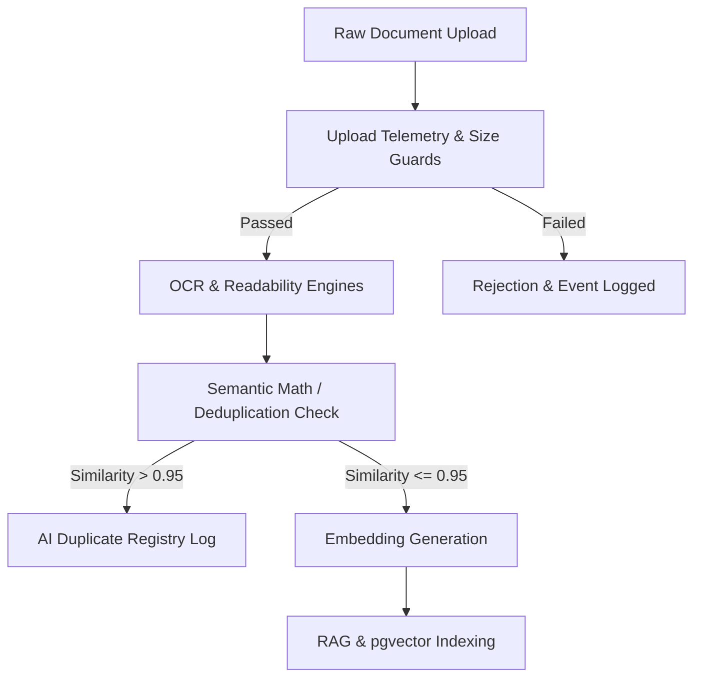
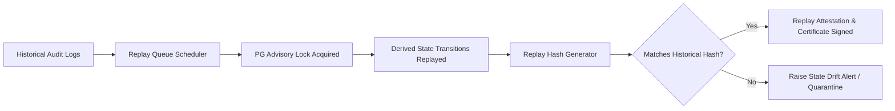
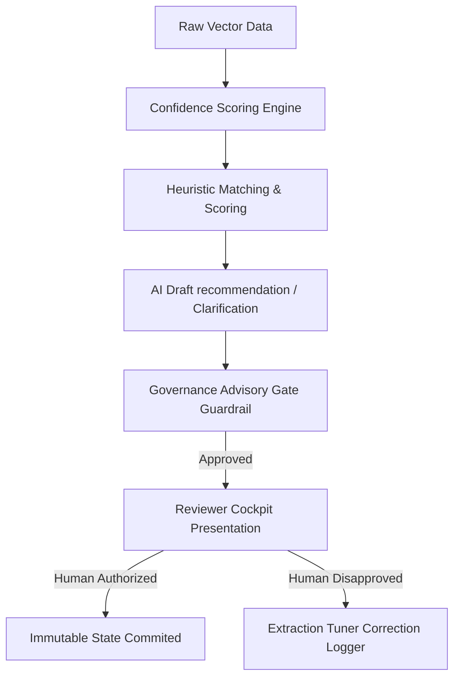
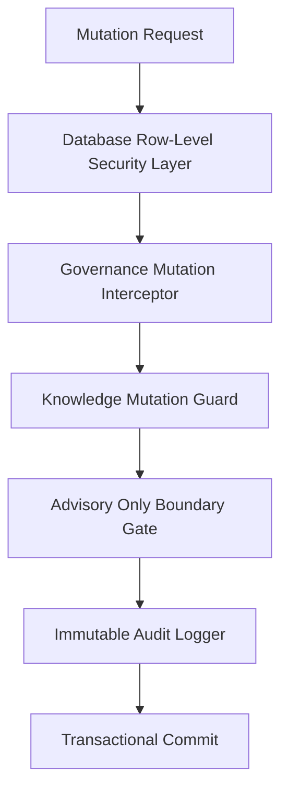
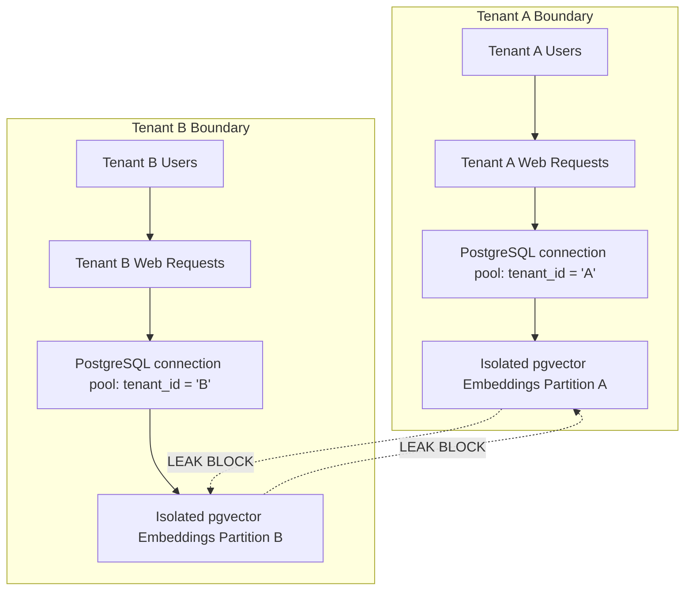
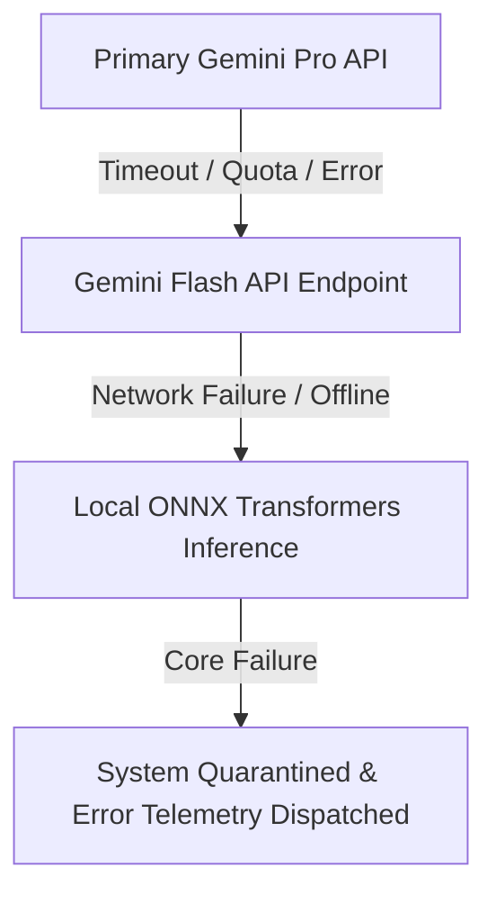

# Tracknov Enterprise Platform Architecture Diagrams

This document contains visual architectural specifications for the Tracknov Sustainability Intelligence Operating System.

---

## 1. Document Ingestion Flow

Shows the pipeline from raw file upload through safety analysis, OCR processing, semantic math deduplication, and database vector indexing.

---

## 2. Deterministic Replay Pipeline

Illustrates how historical event logs are loaded, advisory locks acquired, and sequential mutations replayed to reconstruct verifiable state hashes.

---

## 3. Intelligence Lifecycle

Visualizes the lifecycle of AI-driven recommendations, confidence scoring, drafting, and strict L5/L6 human-in-the-loop review.

---

## 4. Governance & Mutation Enforcement

Details the nesting of guards and boundaries that shield the core state machine from unapproved mutations.

---

## 5. Cross-Tenant Isolation

Illustrates the logical and structural boundaries preventing data leakage between tenants.

---

## 6. AI Fallback Orchestration

Demonstrates the resilient fallback structure when connecting to semantic providers or when the system is offline.

